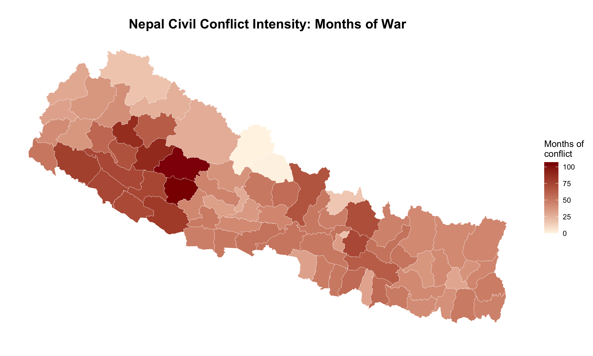

# Nepal-Civil-War-and-Int-Migration

This repository is related to the investigation into the impact of civil conflict (Maoist revolution) of 1996-2006 in Nepal on the international migration. We try to investigate whether the increasing labor migration from Nepal was a result of exposure to civil conflict during their childhood.

## Conflict Intensity

### Conflict Intensity Based on the Months of War

We calculated the conflict intensity based on the months of conflict. The civil conflict lasted for 131 months. 

$$
\begin{equation}
\text{conflict}_{d 1}
=\text{months of war}_{d}
=\sum_{m=1}^{131} 1(\text{casualty}_{d m}).
\label{eq:months_of_war}
\end{equation}
$$

$$
1(\text{casualty}_{dm})=
\begin{cases}
1, & \text{if } \text{casualty}_{dm}>0,\\
0, & \text{otherwise.}
\end{cases}
$$

*Conflictdm* is the intensity based on month of war. It is the sum of 1 or 0 in each 131 months. *1(casualtydm)* takes value 1 if casualty in a district in a month is greater than 0 else *1(casualtydm)* takes value 0. The conflict intensity based on this index has the following distribution:

### Conflict Intensity Based on the Number of Casualties

In addition to above calculation we computed the conflict intensity based on the number of casualties. 

$$
\begin{equation}
\text{conflict}_{d 1}
=\text{number of casualty}_{d}
=\sum_{m=1}^{131} 1(\text{casualty}_{d m}).
\label{eq:months_of_war}
\end{equation}
$$