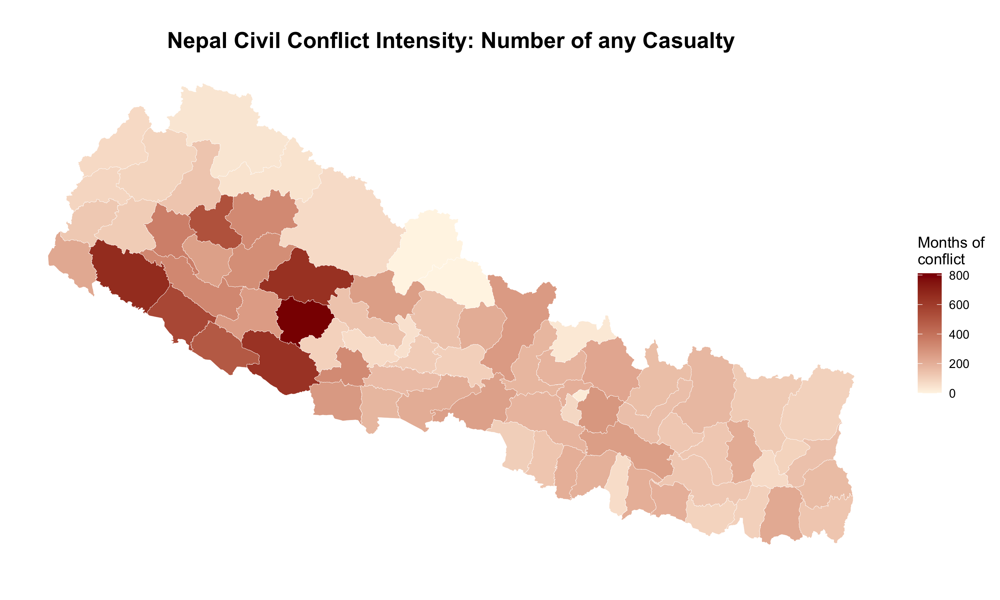

# Nepal-Civil-War-and-Int-Migration

This repository is related to the investigation into the impact of civil conflict (Maoist revolution) of 1996-2006 in Nepal on the international migration. We try to investigate whether the increasing labor migration from Nepal was a result of exposure to civil conflict during their childhood.

## Conflict Intensity

### Conflict Intensity Based on the Months of War

We calculated the conflict intensity based on the months of conflict. The civil conflict lasted for 131 months. 

$$
\begin{equation}
\text{conflict}_{d 1}
=\text{months of war}_{d}
=\sum_{m=1}^{131} 1(\text{casualty}_{d m}).
\end{equation}
$$

$$
1(\text{casualty}_{dm})=
\begin{cases}
1, & \text{if } \text{casualty}_{dm}>0,\\
0, & \text{otherwise.}
\end{cases}
$$

*Conflictd1* is the intensity based on month of war. It is the sum of 1 or 0 in each 131 months. *1(casualtydm)* takes value 1 if casualty in a district in a month is greater than 0 else *1(casualtydm)* takes value 0. The conflict intensity based on this index has the following distribution:

### Conflict Intensity Based on the Number of Casualties

In addition to above calculation we computed the conflict intensity based on the number of casualties. 

$$
\begin{equation}
\text{conflict}_{d 2}
=\text{number of casualty}_{d}
=\sum_{m=1}^{131} \text{casualty}_{d m}.
\end{equation}
$$

*Conflictd2* is the second measure of intensity based on the number of casualties. It is the sum of casualty number over the conflict period in each district. The intensity of conflict based on this index has the following distribution:

## Empirical Strategy

We estimate the following model

$$
\begin{equation}
y_{itdc} = \alpha + \beta_{c}(Conflict \quad Exposure_{d}\times \lambda_{c}) + \lambda_{c} + \delta_t + \eta_{d} + X'_{i} + \varepsilon_{itdc},
\end{equation}
$$

where $y$ is an binary outcome variable for individual $i$ going abroad or not in the year $t$, from district $d$ and cohort $c$, $Conflict \quad Exposure_d$ indicates the different measures for exposure to war in district $d$, $\lambda$ represents the cohort,  $\lambda_{c}$ denotes cohort fixed effect, $\delta_{t}$ is the year fixed effect and $\eta_{d}$ represents district fixed effects. $\varepsilon$ is a random, idiosyncratic error term. The coefficient $\beta$ captures the average treatment effect on the treated. $X^{'}_{i}$ represents the individual level controls including the individual's sex, educational attainment and ethnicity.

## Definition of Cohorts

This paper is based on categorizing the sample into treatment and control group based on their age in 1996. The Cohorts are defined on the following basis: 
- Treatment1: 0-5 years in 1996; Sample who are included in the following category: 
age at start of conflict $\geq 0$

# Structure of Code
The folder [Source Code](/source_code/) contains different code files: [Master](/source_code/00_master.R) which runs all the codes in order, [Setup](/source_code/01_setup.R); contains data paths, packages and global settings,  [Data Cleaning](/source_code/02_data_cleaning.R); Import, clean data, create variables, categorises treatment/control cohorts and intensity of conflict,  [Summary](/source_code/03_summary_statistics.R); produces descriptive statistics, balance check and DiD Framework, [Main Regression](/source_code/04_regression_main.R); includes all main DiD regression, [Robustness Check](/source_code/05_robustness.R); contains codes for sensitivity analysis, [Mechanism Analysis](/source_code/06_mechanism_analysis.R); contains codes for analysis of the channels  and [Helper Function](/source_code/Helper_functions.R) contains codes for formatting the tables and coefficient dictionaries.

## How to Use
### Option 1: Run Everything at once
Open [Master](/source_code/00_master.R) and run all the code.

### Option 2: Run each code as per need
First run [01_setup.R](/source_code/01_setup.R), then [02_data_cleaning.R](/source_code/02_data_cleaning.R) then any other as required. 